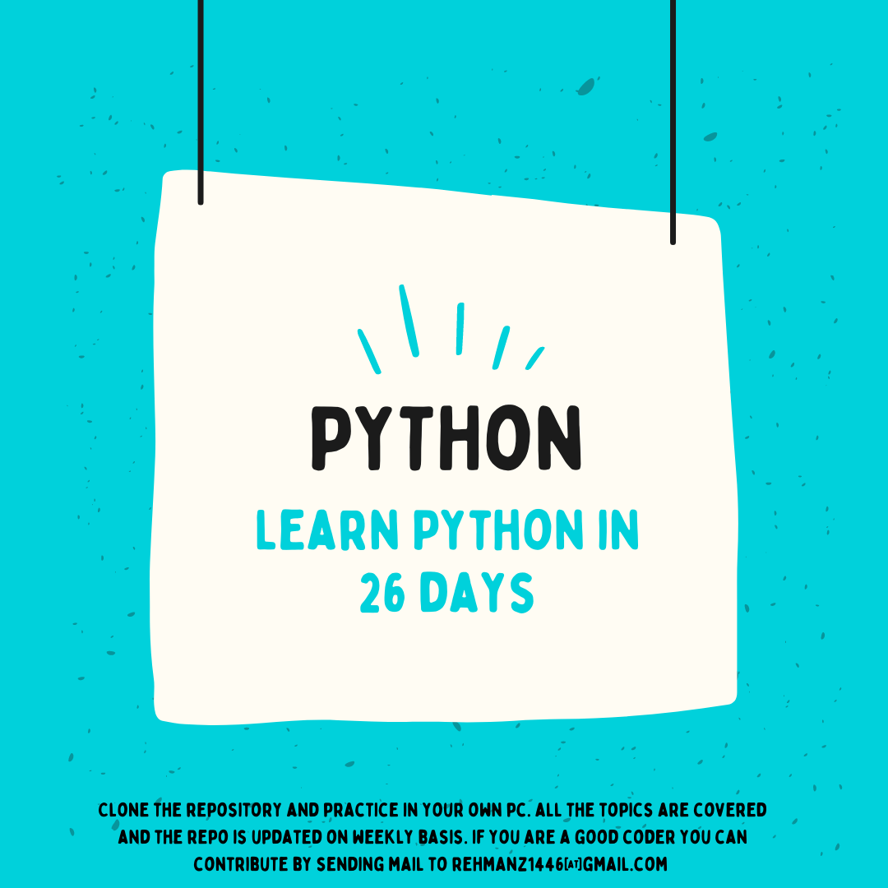

<h1>Learn Python in 26 Days</h1>
<h2>In this bootcamp of 26 days learn about the following topics</h2>
<ul>
<li>1. Intro about Python</li>
  <li>2. Getting started with Python</li>
  <li>3. Basics in Python</li>
  <li>4. Strings</li>
  <li>5. Decision control</li>
  <li>6. Repetition control</li>
  <li>7. Console input/output</li>
  <li>8. Lists</li>
  <li>9. Tuples</li>
  <li>10.Sets</li>
  <li>11. Dictionaries</li>
  <li>12. Comprehensions</li>
  <li>13. Functions</li>
  <li>14. Recursion</li>
    <li>15. Functional Programming</li>
    <li>16. Modules and packages</li>
    <li>17. Namespaces</li>
    <li>18. Classes and Objects</li>
    <li>19. Intricasies of CLasses and Objects</li>
    <li>20. Containership and Inheritance</li>
    <li>21. Iterators and Generators</li>
    <li>22. Exception Handling</li>
    <li>23. File Input output</li>
    <li>24. Miscellany</li>
    <li>25. Concurrency and Parallelism</li>
    <li>26. Synchronization</li>
</ul>

<h1>How to Use This Repository</h1>
You can clone this repository to your local machine to access all the topics and examples. Each topic follows the structured format mentioned above, making it easy to navigate and understand different Python concepts.

<h1>Contribution</h1>
If you find any issues, want to improve the content, or have suggestions for new topics, feel free to submit a pull request.

<h1>License</h1>
This repository is under the MIT License. Feel free to use and share it!
Using this format, learners will have a clear and organized structure for each topic, including syntax, explanations, examples, and exercises. This will make the repository more user-friendly and valuable for Python learners. Remember to provide accurate and comprehensive explanations to help learners grasp the concepts effectively.
